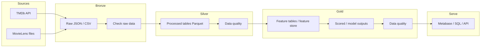

# Pipeline diagram (draft)

Mermaid diagram for GitHub / markdown preview. Source of truth for layers: `../architecture.md`.

```mermaid
flowchart LR
  subgraph Sources
    TMDb[TMDb API]
    ML[MovieLens files]
  end

  subgraph Bronze
    Raw[Raw JSON / CSV]
    RawCheck[Check raw data]
  end

  subgraph Silver
    Clean[Processed tables Parquet]
    DQ1[Data quality]
  end

  subgraph Gold
    Feat[Feature tables / feature store]
    Score[Scored / model outputs]
    DQ2[Data quality]
  end

  subgraph Serve
    Out[Metabase / SQL / API]
  end

  TMDb --> Raw
  ML --> Raw
  Raw --> RawCheck --> Clean --> DQ1 --> Feat --> Score --> DQ2 --> Out
```
